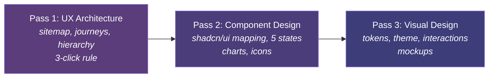
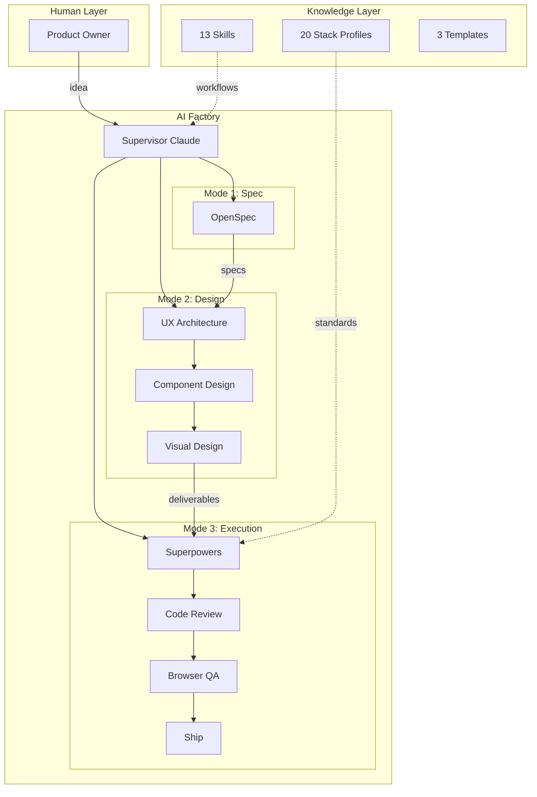

# AI-Factory

An operating system for building software products with Claude Code. One human, many AI agents, structured workflows from idea to deployed product.

## The Problem

Building products with AI is fast but chaotic. Without structure, you get:
- Claude jumping to code before understanding the problem
- Inconsistent UI across projects (hand-rolled everything, no design system)
- "Tests pass" but the app looks broken in a browser
- No deployment pipeline — code sits unshipped
- Context lost between sessions — you re-explain the same things

## The Solution

AI-Factory separates concerns into **three strict modes** with distinct AI roles, enforced by a `CLAUDE.md` operating system that Claude reads at the start of every session.

```
Human = Product Owner (decides WHAT)
Claude = Product Manager → Designer → Engineer (decides HOW)
```

The factory handles everything between "I have an idea" and "it's live on the internet."

## How It Works

### End-to-End Pipeline

```mermaid
graph LR
    A["Idea"] --> AB["Competition Review<br/><i>map landscape</i>"]
    AB --> B["Product Taste<br/><i>challenge it</i>"]
    B --> C["Spec<br/><i>/opsx:propose</i>"]
    C --> D["Design<br/><i>3-pass</i>"]
    D --> E["Build<br/><i>TDD</i>"]
    E --> F["Test"]
    F --> G["QA<br/><i>browser / MCP</i>"]
    G --> H["Ship<br/><i>PR</i>"]
    H --> I["Deploy"]
    I --> J["Verify<br/><i>prod QA</i>"]
    J --> K["Archive<br/><i>specs</i>"]
    K -->|"next task"| C

    style AB fill:#4a5d7a,color:#fff
    style B fill:#6b3d7a,color:#fff
    style C fill:#2d4a7a,color:#fff
    style D fill:#5a3d7a,color:#fff
    style E fill:#3d6b4f,color:#fff
    style G fill:#4a6b7a,color:#fff
    style H fill:#3d6b4f,color:#fff
    style I fill:#7a5a2d,color:#fff
    style J fill:#4a6b7a,color:#fff
```



Every step has a skill, stack profile, or template backing it. Nothing is ad hoc.

### Three Modes

| Mode | AI Role | What It Does | Outputs |
|------|---------|-------------|---------|
| **Spec** | Product Manager | Challenges the idea, writes specs, generates tasks | Proposal, design doc, specs, task list |
| **Design** | Product Designer | Three passes: UX architecture → component mapping → visual design | Sitemap, journey maps, component specs, style tokens |
| **Execution** | Engineer | TDD implementation, code review, browser QA, shipping | Production code, tests, PR |

Modes never mix. The Designer doesn't write code. The Engineer doesn't change specs. This separation is the core discipline that prevents AI from cutting corners.

### Design Mode: Three Passes

Design Mode runs three sequential passes before any code is written:



**Pass 1** answers *why things go where* — information hierarchy, user journeys with click counts, task flows.
**Pass 2** answers *what components to use* — maps every screen region to specific shadcn/ui components, designs all 5 states (empty, loading, populated, error, overflow).
**Pass 3** answers *how it looks* — style tokens, theme config, interaction specs. Now informed by passes 1-2 instead of decorating in the dark.

### Cognitive Postures

Within Execution Mode, the Engineer adopts different mindsets depending on the task:

| Posture | Relationship to Code | Activated By |
|---------|---------------------|-------------|
| **Builder** | Adds new code. TDD rhythm, forward momentum. | `test-driven-development`, `writing-plans`, `executing-plans` |
| **Reviewer** | Questions existing code. Skeptical, looking for what's wrong. | `code-review`, `structural-review` |
| **Debugger** | Investigates failures. Hypothesis-driven, no guessing. | `systematic-debugging` |
| **Tester** | Uses the app as a real user. Evidence-driven, not code-driven. | `qa` (browser QA), `mcp-qa` (MCP servers) |
| **Shipper** | Gets code landed. Changelog, version, PR. No corners cut. | `ship`, `finishing-a-development-branch` |

A builder adds, a reviewer questions, a debugger investigates, a tester uses, a shipper packages. Mixing postures weakens all of them.

## Architecture



## Stack Profiles

20 stack profiles capture everything Claude needs to write idiomatic, tested, production-quality code. Each acts as a "senior engineer" for that technology — Claude reads it before writing any code.

### Application Stacks

| Stack | What It Covers |
|-------|---------------|
| `stacks/typescript/` | TypeScript + Node.js. Framework-agnostic base for any TS project |
| `stacks/nextjs/` | Next.js App Router: Server Components, Server Actions, SSR/SSG/ISR |
| `stacks/python/` | Python 3.11+: uv, Ruff, Pydantic, pytest, AI/ML patterns |
| `stacks/swift/` | Swift/iOS: SwiftUI, MVVM, structured concurrency, SwiftData |
| `stacks/kotlin/` | Kotlin/Android: Jetpack Compose, MVVM, Coroutines, Room, Hilt |
| `stacks/react-native/` | React Native: Expo, Expo Router, cross-platform mobile |
| `stacks/godot/` | Godot 4 + GDScript: game development, GUT testing, AI asset generation |

### Backend & API Stacks

| Stack | What It Covers |
|-------|---------------|
| `stacks/node-backend/` | Express/Fastify: middleware, auth, Prisma/Drizzle |
| `stacks/fastapi/` | FastAPI: Pydantic v2, async, FARM stack patterns |
| `stacks/dotnet/` | .NET 8: Minimal APIs, EF Core, MediatR, C# 12+ |
| `stacks/mcp/` | MCP server development: tool design, security, publishing |

### Database Stacks

| Stack | What It Covers |
|-------|---------------|
| `stacks/sql/` | PostgreSQL/SQLite: schema design, migrations, RLS, indexing |
| `stacks/nosql/` | MongoDB/Redis/DynamoDB: document design, caching, aggregation |
| `stacks/vector-db/` | Pinecone/pgvector/ChromaDB: embeddings, RAG, chunking |

### Platform & Infrastructure

| Stack | What It Covers |
|-------|---------------|
| `stacks/saas/` | Cloudflare + Supabase + Stripe: full SaaS stack with first-deploy guide |
| `stacks/landing/` | Static sites: SEO, analytics, Astro/11ty, Cloudflare Pages |
| `stacks/infra/` | CI/CD: GitHub Actions, Docker, Cloudflare, Railway |
| `stacks/browser-qa/` | Browser QA: headless Chromium via gstack browse |
| `stacks/ui/` | UI toolkit: shadcn/ui, Tailwind, Radix, Recharts, Lucide, design token pipeline |

### Meta

| Stack | What It Covers |
|-------|---------------|
| `stacks/template-system/` | Stack profile scaffolding and validation |

### Creating a New Stack

```bash
./scripts/new-stack.sh <stack-name>    # scaffold from template
./scripts/validate-stacks.sh           # check all stacks for completeness
```

## Skills

13 custom skills extend the factory workflow, all template-generated from `.tmpl` source files with shared partials for consistency:

| Skill | When | What It Does |
|-------|------|-------------|
| `competition-review` | Before product-taste | Maps competitive landscape: domain-aware web search, gap analysis, differentiation angle |
| `product-taste` | Before proposing features | Challenges ideas: premise, persona, scope modes (expansion/hold/reduction) |
| `structural-review` | Before landing code | Paranoid audit: race conditions, trust boundaries, error handling, test gaps |
| `ship` | When ready to ship | Merge, test, review, changelog, version bump, OpenSpec archive, PR |
| `qa` | After implementing web features | 4-mode browser QA: diff-aware, full, quick, regression. Health score + screenshots |
| `mcp-qa` | After implementing MCP server features | End-to-end MCP integration test: spawn server, connect client, exercise tools, lint best practices. Health score |
| `factory-retrospective` | Periodic check-in | Cross-project retro: velocity, quality, session patterns, trend tracking |
| `marketing-copy` | When writing launch content | Platform-specific copy: Product Hunt, App Store, landing pages, social |
| `openspec-propose` | Starting a new feature | Propose a change with all artifacts (proposal, design, specs, tasks) |
| `openspec-explore` | Investigating an idea | Thinking partner for exploring requirements and clarifying scope |
| `openspec-apply-change` | Implementing tasks | Work through OpenSpec tasks with progress tracking |
| `openspec-archive-change` | After shipping | Archive completed changes into master specs |
| `factory-overview` | Starting a session | Dashboard scan of all projects, backlog, and pipeline status |

### Skill Infrastructure

Skills are template-driven — edit `.claude/skills/*/SKILL.md.tmpl`, never the generated `SKILL.md`. Shared blocks (Socrates voice, contributor mode, AskUserQuestion format, health scoring, artifact save, pipeline handoff) live in `.claude/skills/partials/` and are injected at generation time.

**Contributor mode** lets skills self-rate their experience 0-10 and file field reports when something isn't a 10. The factory retrospective surfaces trends from these reports.

**Three-tier eval system** validates skills: Tier 1 static validation (free), Tier 2 E2E execution via `claude -p`, Tier 3 LLM-as-judge scoring on clarity/completeness/actionability.

```bash
bun run gen:skill-docs        # regenerate all skills from templates
bun test                      # Tier 1 static validation (17 tests)
bun run test:evals            # Tier 3 LLM-as-judge
```

## Templates

| Template | For | Includes |
|----------|-----|---------|
| `templates/ai-product-template/` | Non-web products (games, CLIs, APIs) | CLAUDE.md, README, .gitignore, src/, tests/ |
| `templates/web-product/` | Web products (SaaS, sites) | Above + 3-pass Design Mode, shadcn/ui, CI workflow, browser QA |
| `templates/stack-profile/` | New stack profiles | 5 template files for consistent stack documentation |

## Key Concepts

**Three strict modes.** Spec, design, and execution never mix. This prevents Claude from jumping to code before the problem is understood.

**Stack profiles as senior engineers.** Rather than hoping Claude knows best practices, the stack profile tells it exactly how to write code for that technology.

**Three-pass design.** UX architecture before component selection before visual design. Each pass informs the next. No more decorating in the dark.

**Projects are independent.** Each product lives in its own git repo under `projects/`. The factory provides workflow and standards; projects own their code.

**End-to-end pipeline.** From idea to deployed product: competition review → product taste → spec → design → build → test → QA → ship → deploy → verify → archive. Every step is covered.

**Context hygiene.** Clear the conversation after each major task. Memory files persist across clears, so institutional knowledge is retained without context bleed.

## Prerequisites

- [Claude Code](https://docs.anthropic.com/en/docs/claude-code) (CLI or Desktop)
- A Claude Pro or Team subscription

### Required Plugins

```bash
claude plugin install superpowers@claude-plugins-official
claude plugin install code-review@claude-plugins-official
claude plugin install commit-commands@claude-plugins-official
```

| Plugin | Role | What It Does |
|--------|------|-------------|
| **Superpowers** | Engineering Team | TDD, code review, subagent-driven development, worktrees, debugging |
| **Code Review** | Quality Gate | Pull request review against plans and coding standards |
| **Commit Commands** | Git Automation | Commit, push, PR creation, branch cleanup |

OpenSpec is invoked via slash commands (`/opsx:propose`, `/opsx:explore`, `/opsx:archive`) — no separate install needed.

### Optional: Browser QA

For web projects, install [gstack browse](https://github.com/garrytan/gstack) for headless browser testing:

```bash
git clone https://github.com/garrytan/gstack.git ~/.claude/skills/gstack
cd ~/.claude/skills/gstack && ./setup
```

See `stacks/browser-qa/setup.md` for details.

## Getting Started

1. Clone this repo
2. Install Claude Code and the plugins above
3. Run `claude` from the repo root
4. Create a new project:
   ```bash
   # Non-web product (game, CLI, API)
   cp -r templates/ai-product-template projects/your-project

   # Web product (SaaS, site)
   cp -r templates/web-product projects/your-project
   ```
5. Start with `/opsx:propose "your idea"` to enter Spec Mode

## Vision: Factory Control Plane

The factory currently runs as independent Claude Code sessions — one per project, orchestrated by the human switching between terminals. The next evolution is a **control plane** that sits above project sessions:

- **Knows** what each project agent is doing, what's blocked, what just finished
- **Surfaces** only decisions that need human attention (not raw data)
- **Routes** information by type: alerts (blocking), notifications (state changes), status (heartbeats)
- **Translates** operator commands ("publish it") into session-level actions

See [docs/drafts/factory-control-plane-vision.md](docs/drafts/factory-control-plane-vision.md) for the full vision.

## Roadmap

See [docs/plans/2026-03-14-roadmap.md](docs/plans/2026-03-14-roadmap.md).

**Completed:** Bucket 1 (workflow skills), Bucket 2 (browser QA + web support). Bucket 3 (control plane, analytics) in progress.

## Acknowledgments

- [gstack](https://github.com/garrytan/gstack) by Garry Tan — the `qa`, `structural-review`, `ship`, `product-taste`, and `factory-retrospective` skills were adapted from gstack's workflows. The skill template system (contributor mode, template-driven generation, three-tier evals) was inspired by gstack's architecture
- [OpenSpec](https://www.npmjs.com/package/@fission-ai/openspec) by Fission AI — powers the spec pipeline (`/opsx:propose`, `/opsx:explore`, `/opsx:archive`)
- [Superpowers](https://www.npmjs.com/package/superpowers), [Code Review](https://www.npmjs.com/package/code-review), and [Commit Commands](https://www.npmjs.com/package/commit-commands) by claude-plugins-official — engineering execution, PR review, and git automation

## License

MIT. See [LICENSE](LICENSE).
