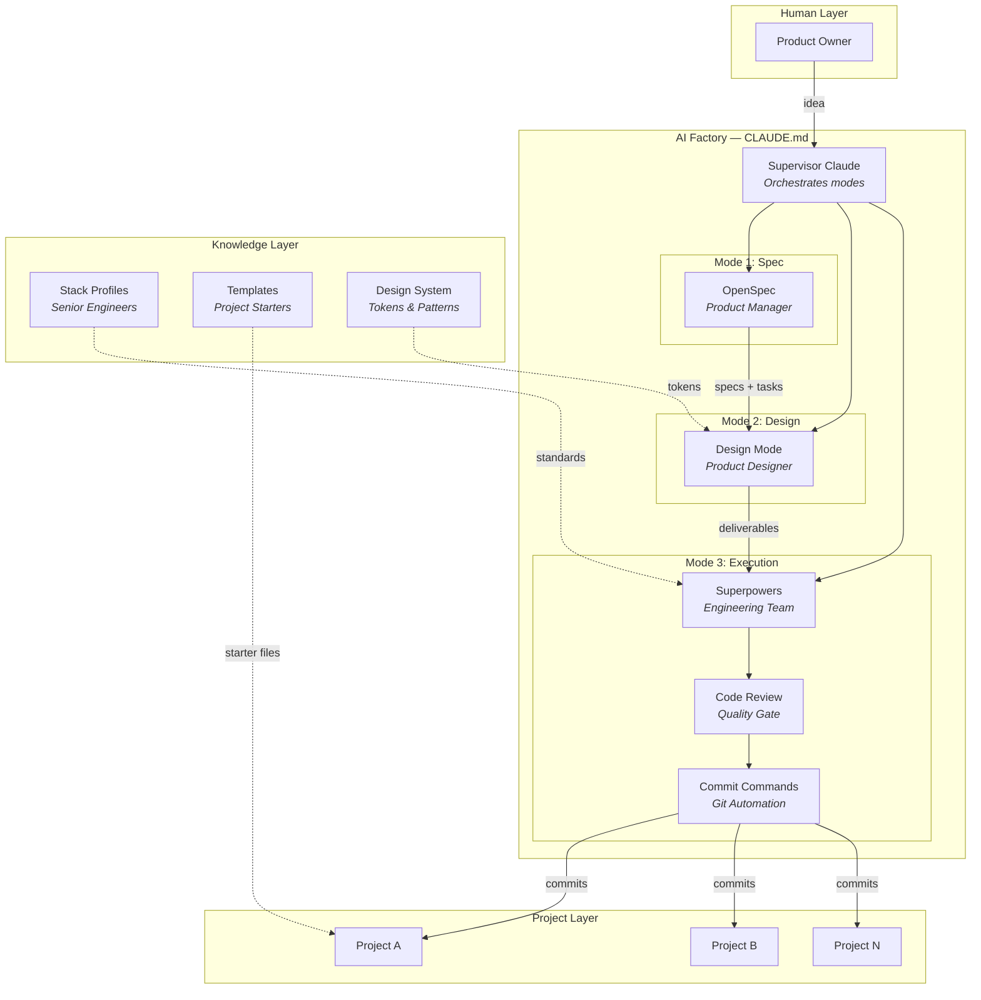
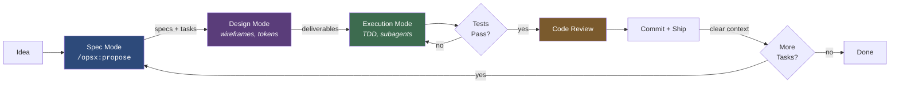

# AI-Factory

A personal AI product factory — an operating system for building software products with Claude Code as the orchestrator.

## What This Is

AI-Factory is a structured workflow for building products with AI. Instead of one monolithic Claude session doing everything, it separates concerns into three modes with distinct roles:

1. **Spec Mode** (OpenSpec) — defines *what* to build. Creates specs, acceptance criteria, and task files.
2. **Design Mode** — defines *how it looks and feels*. Produces wireframes, style tokens, mockups, and interaction specs. No production code.
3. **Execution Mode** (Superpowers) — builds it. Implements tasks with TDD, code review, and subagent-driven development.

The human is the Product Owner. Claude switches between Product Manager, Designer, and Engineer roles depending on the mode.

## Architecture

### Tool Ecosystem



### Project Lifecycle



## Stack Profiles

Stack profiles capture everything Claude needs to write idiomatic, tested, production-quality code in a given technology:

| Stack | Contents |
|-------|----------|
| `stacks/godot/` | Godot 4 + GDScript — coding standards, testing (GUT), project structure, pitfalls, performance |
| `stacks/typescript/` | TypeScript + Node.js — framework-agnostic base for any TS project |
| `stacks/mcp/` | MCP server development — tool design, security, testing, publishing. Layers on TypeScript |

Each profile includes a `STACK.md` overview plus focused docs (read only the ones relevant to the current task).

## Key Concepts

**Three strict modes** — spec, design, and execution never mix. This prevents Claude from jumping to code before the problem is understood.

**Stack profiles as senior engineers** — rather than hoping Claude knows Godot or MCP best practices, the stack profile tells it exactly how to write code for that technology.

**Projects are independent** — each product lives in its own git repo under `projects/`. The factory provides workflow and standards; projects own their code.

**Context hygiene** — clear the conversation after each major task. Memory files persist across clears, so institutional knowledge is retained without context bleed.

## Prerequisites

- [Claude Code](https://docs.anthropic.com/en/docs/claude-code) (CLI or Desktop)
- A Claude Pro or Team subscription

### Required Plugins

AI-Factory uses Claude Code plugins for its three-mode workflow. These are **Claude Code-only** — they don't work in Cursor, VS Code, or other editors.

Install them after cloning:

```bash
claude plugin install superpowers@claude-plugins-official
claude plugin install code-review@claude-plugins-official
claude plugin install commit-commands@claude-plugins-official
```

| Plugin | Role | What It Does |
|--------|------|-------------|
| **Superpowers** | Engineering Team | TDD, code review, subagent-driven development, worktrees, systematic debugging |
| **Code Review** | Quality Gate | Pull request review against plans and coding standards |
| **Commit Commands** | Git Automation | Commit, push, PR creation, branch cleanup |

OpenSpec (the Product Manager) is invoked via slash commands (`/opsx:propose`, `/opsx:explore`, `/opsx:archive`) and doesn't require a separate plugin install.

## Getting Started

1. Clone this repo
2. Install Claude Code and the plugins above
3. Run `claude` from the repo root
4. Create a new project: copy `templates/ai-product-template/` to `projects/your-project/`
5. Start with `/opsx:propose "your idea"` to enter Spec Mode

## Roadmap

See [docs/plans/2026-03-14-roadmap.md](docs/plans/2026-03-14-roadmap.md) for planned enhancements across three time horizons.

## License

MIT — see [LICENSE](LICENSE)
