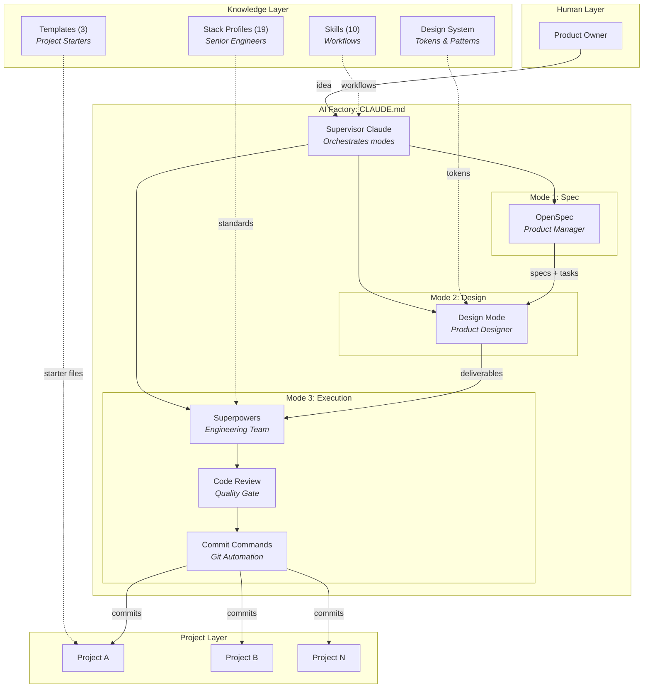

# AI-Factory

A personal AI product factory (an operating system for building software products with Claude Code as the orchestrator).

## What This Is

AI-Factory is a structured workflow for building products with AI. Instead of one monolithic Claude session doing everything, it separates concerns into three modes with distinct roles:

1. **Spec Mode** (OpenSpec): defines *what* to build. Creates specs, acceptance criteria, and task files.
2. **Design Mode**: defines *how it looks and feels*. Produces wireframes, style tokens, mockups, and interaction specs. No production code.
3. **Execution Mode** (Superpowers): builds it. Implements tasks with TDD, code review, and subagent-driven development.

The human is the Product Owner. Claude switches between Product Manager, Designer, and Engineer roles depending on the mode.

## Architecture

### Tool Ecosystem



### Project Lifecycle

```mermaid
graph LR
    A["Idea"] --> PT["Product Taste<br/><i>challenge the idea</i>"]
    PT --> B["Spec Mode<br/><code>/opsx:propose</code>"]
    B -->|"specs + tasks"| C["Design Mode<br/><i>wireframes, tokens</i>"]
    C -->|"deliverables"| D["Execution Mode<br/><i>TDD, subagents</i>"]
    D --> E{"Tests<br/>Pass?"}
    E -->|"no"| D
    E -->|"yes"| QA["Browser QA<br/><i>diff-aware</i>"]
    QA --> F["Structural Review"]
    F --> G["Ship<br/><i>changelog, PR</i>"]
    G -->|"clear context"| H{"More<br/>Tasks?"}
    H -->|"yes"| B
    H -->|"no"| I["Done"]

    style PT fill:#6b3d7a,color:#fff
    style B fill:#2d4a7a,color:#fff
    style C fill:#5a3d7a,color:#fff
    style D fill:#3d6b4f,color:#fff
    style QA fill:#4a6b7a,color:#fff
    style F fill:#7a5a2d,color:#fff
    style G fill:#3d6b4f,color:#fff
```



## Stack Profiles

19 stack profiles capture everything Claude needs to write idiomatic, tested, production-quality code:

### Application Stacks

| Stack | What It Covers |
|-------|---------------|
| `stacks/typescript/` | TypeScript + Node.js. Framework-agnostic base for any TS project |
| `stacks/nextjs/` | Next.js App Router: Server Components, Server Actions, SSR/SSG/ISR. Layers on TypeScript |
| `stacks/python/` | Python 3.11+: uv, Ruff, Pydantic, pytest, AI/ML integration patterns |
| `stacks/swift/` | Swift/iOS: SwiftUI, MVVM, structured concurrency, SwiftData |
| `stacks/kotlin/` | Kotlin/Android: Jetpack Compose, MVVM, Coroutines, Room, Hilt |
| `stacks/react-native/` | React Native: Expo, Expo Router, cross-platform mobile. Layers on TypeScript |
| `stacks/godot/` | Godot 4 + GDScript: game development, GUT testing, AI asset generation |

### Backend & API Stacks

| Stack | What It Covers |
|-------|---------------|
| `stacks/node-backend/` | Express/Fastify: middleware, auth, Prisma/Drizzle. Layers on TypeScript |
| `stacks/fastapi/` | FastAPI: Pydantic v2, async, FARM stack patterns. Layers on Python |
| `stacks/dotnet/` | .NET 8: Minimal APIs, EF Core, MediatR, C# 12+ |
| `stacks/mcp/` | MCP server development: tool design, security, publishing. Layers on TypeScript |

### Database Stacks

| Stack | What It Covers |
|-------|---------------|
| `stacks/sql/` | PostgreSQL/SQLite: schema design, migrations, RLS, indexing, connection pooling |
| `stacks/nosql/` | MongoDB/Redis/DynamoDB: document design, caching, aggregation pipelines |
| `stacks/vector-db/` | Pinecone/pgvector/ChromaDB: embeddings, RAG pipelines, chunking, retrieval testing |

### Platform & Infrastructure Stacks

| Stack | What It Covers |
|-------|---------------|
| `stacks/saas/` | Cloudflare + Supabase + Stripe: full SaaS stack with auth, payments, deployment |
| `stacks/landing/` | Static sites: SEO, analytics, Astro/11ty, Cloudflare Pages |
| `stacks/infra/` | CI/CD: GitHub Actions, Docker, Cloudflare, Railway, monitoring |
| `stacks/browser-qa/` | Browser QA testing: headless Chromium via gstack browse |

### Meta

| Stack | What It Covers |
|-------|---------------|
| `stacks/template-system/` | Stack profile scaffolding and validation |

Each profile includes a `STACK.md` overview plus focused docs (coding standards, testing, project structure, pitfalls, and stack-specific extras).

### Creating a New Stack

```bash
./scripts/new-stack.sh <stack-name>    # scaffold from template
./scripts/validate-stacks.sh           # check all stacks for completeness
```

## Skills

10 custom skills extend the factory workflow:

### Factory Skills

| Skill | Trigger | What It Does |
|-------|---------|-------------|
| `product-taste` | Before proposing features | Challenges ideas with product thinking: premise, persona, scope modes (expansion/hold/reduction) |
| `structural-review` | Before landing code | Paranoid pre-landing audit: race conditions, trust boundaries, error handling, test gaps |
| `ship` | When ready to ship | Automated shipping: merge, test, review, changelog, version bump, bisectable commits, PR |
| `factory-retrospective` | Periodic check-in | Cross-project retro: velocity, quality, session patterns, trend tracking |
| `qa` | After implementing web features | 4-mode browser QA: diff-aware, full, quick, regression. Health score + screenshots |
| `marketing-copy` | When writing launch content | Platform-specific copy: Product Hunt, App Store, landing pages, social, README |

### OpenSpec Skills

| Skill | What It Does |
|-------|-------------|
| `openspec-propose` | Propose a change with all artifacts |
| `openspec-explore` | Explore ideas and requirements |
| `openspec-apply-change` | Implement tasks from a change |
| `openspec-archive-change` | Archive a completed change |

## Templates

| Template | For | What's Included |
|----------|-----|----------------|
| `templates/ai-product-template/` | Non-web products (games, CLIs, APIs) | CLAUDE.md, README, .gitignore, src/, tests/ |
| `templates/web-product/` | Web products (SaaS, sites) | Everything above + browser QA integration, .gstack/ directory |
| `templates/stack-profile/` | New stack profiles | 5 .tmpl files for scaffolding consistent stack docs |

## Cognitive Postures

Within Execution Mode, the Engineer adopts different postures depending on the task:

- **Builder**: writing new code, TDD rhythm, forward momentum
- **Reviewer**: examining code, skeptical posture, looking for what's wrong
- **Debugger**: investigating failures, hypothesis-driven, no guessing
- **Shipper**: getting code landed, changelog, version, PR

Skills activate the right posture automatically.

## Key Concepts

**Three strict modes.** Spec, design, and execution never mix. This prevents Claude from jumping to code before the problem is understood.

**Stack profiles as senior engineers.** Rather than hoping Claude knows best practices, the stack profile tells it exactly how to write code for that technology.

**Projects are independent.** Each product lives in its own git repo under `projects/`. The factory provides workflow and standards; projects own their code.

**Context hygiene.** Clear the conversation after each major task. Memory files persist across clears, so institutional knowledge is retained without context bleed.

**Factory retro nudge.** If 7+ days since the last retro, the factory mentions it once at session start.

## Prerequisites

- [Claude Code](https://docs.anthropic.com/en/docs/claude-code) (CLI or Desktop)
- A Claude Pro or Team subscription

### Required Plugins

AI-Factory uses Claude Code plugins for its three-mode workflow. These are **Claude Code-only** (they don't work in Cursor, VS Code, or other editors).

Install them after cloning:

```bash
claude plugin install superpowers@claude-plugins-official
claude plugin install code-review@claude-plugins-official
claude plugin install commit-commands@claude-plugins-official
```

| Plugin | Role | What It Does |
|--------|------|-------------|
| **Superpowers** | Engineering Team | TDD, code review, subagent-driven development, worktrees, systematic debugging |
| **Code Review** | Quality Gate | Pull request review against plans and coding standards |
| **Commit Commands** | Git Automation | Commit, push, PR creation, branch cleanup |

OpenSpec (the Product Manager) is invoked via slash commands (`/opsx:propose`, `/opsx:explore`, `/opsx:archive`) and doesn't require a separate plugin install.

### Optional: Browser QA

For web projects, install [gstack browse](https://github.com/garrytan/gstack) for headless browser testing. See `stacks/browser-qa/setup.md`.

## Getting Started

1. Clone this repo
2. Install Claude Code and the plugins above
3. Run `claude` from the repo root
4. Create a new project:
   - Non-web: `cp -r templates/ai-product-template projects/your-project`
   - Web: `cp -r templates/web-product projects/your-project`
5. Start with `/opsx:propose "your idea"` to enter Spec Mode

## Vision: Factory Control Plane

The factory currently runs as independent Claude Code sessions — one per project, orchestrated by the human switching between terminals. The next evolution is a **control plane** that sits above project sessions:

- **Knows** what each project agent is doing, what's blocked, what just finished
- **Surfaces** only decisions that need human attention (not raw data)
- **Routes** information by type: alerts (blocking), notifications (state changes), status (heartbeats), logs (stored for drill-down)
- **Translates** operator commands ("publish it") into session-level actions

Three possible interfaces under consideration: chat app (Slack/Discord) for push notifications and async steering, frontend dashboard for glanceable mission control with analytics, and CLI for scripting and automation.

See [docs/drafts/factory-control-plane-vision.md](docs/drafts/factory-control-plane-vision.md) for the full vision document.

## Roadmap

See [docs/plans/2026-03-14-roadmap.md](docs/plans/2026-03-14-roadmap.md) for planned enhancements.

**Completed:** Bucket 1 (workflow skills) and Bucket 2 (browser QA + web support). Bucket 3 (long-term vision) in progress.

## License

MIT. See [LICENSE](LICENSE).
